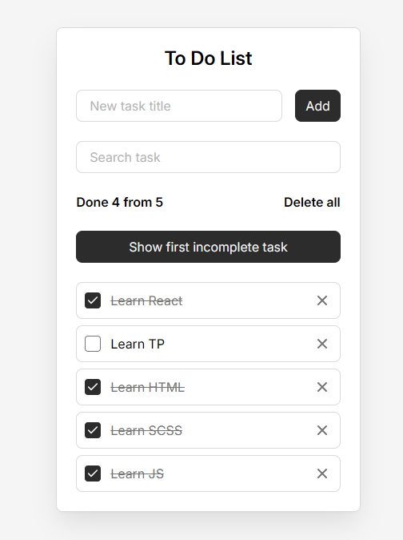

# React Todo List

A feature-rich Todo List application built with React as a practice project focused on hooks, performance optimization, and modern state management patterns.

## Demo
https://illiashp.github.io/todo-react/

## Tech Stack

- React 18 — component-based UI library
- JavaScript ES6+ — destructuring, optional chaining, nullish coalescing
- Vite — fast development build tool
- CSS — custom styling with CSS variables, organized by component

## Features

- Add new tasks
- Mark tasks as complete or incomplete
- Delete individual tasks or clear all at once
- Real-time task search and filtering
- Persistent storage via localStorage — tasks survive page refresh
- Smooth scroll to the first incomplete task

## React Concepts Practiced

useState — managing tasks list, search query, and new task title

useEffect — syncing tasks to localStorage and auto-focusing input on mount

useRef — referencing the input element for focus control and first incomplete task for smooth scroll

useCallback — memoizing addTask, deleteTask, toggleTaskComplete to prevent unnecessary function recreation on every render

useMemo — memoizing filteredTasks and doneTasks count so expensive computations only re-run when dependencies change

memo — wrapping TodoList and TodoInfo so components skip re-rendering when their props have not changed

Lazy state initialization — useState with a function reads from localStorage only once on mount instead of on every render

Controlled components — form inputs are fully controlled via React state

crypto.randomUUID() — generating unique task IDs natively in the browser

## Project Structure

src/components/AddTaskForm.jsx — form for adding new tasks

src/components/Button.jsx — reusable button component

src/components/Field.jsx — reusable input field with label

src/components/SearchTaskForm.jsx — form for filtering tasks

src/components/Todo.jsx — main component with all state and logic

src/components/TodoInfo.jsx — displays task stats and delete all button

src/components/TodoItem.jsx — single task item

src/components/TodoList.jsx — renders the list of tasks

## Installation

git clone https://github.com/IlliaSHP/todo-react.git

cd todo-react

npm install

npm run dev

## Roadmap

- Task priority levels
- Due dates
- Drag and drop reordering
- Dark mode
- Unit tests with React Testing Library

## License

This project is open source and available under the MIT License.